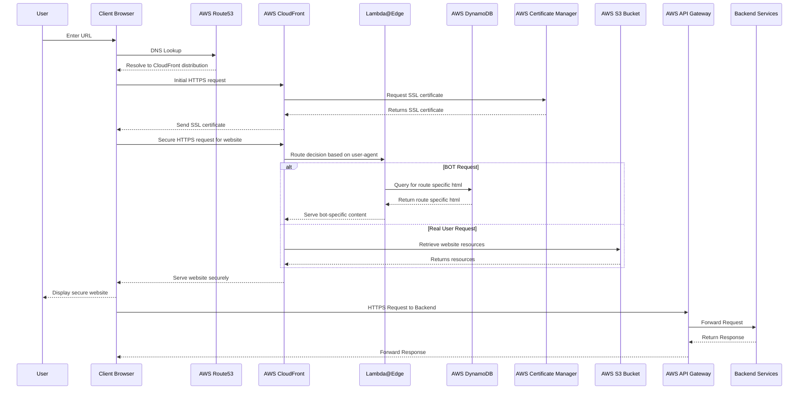
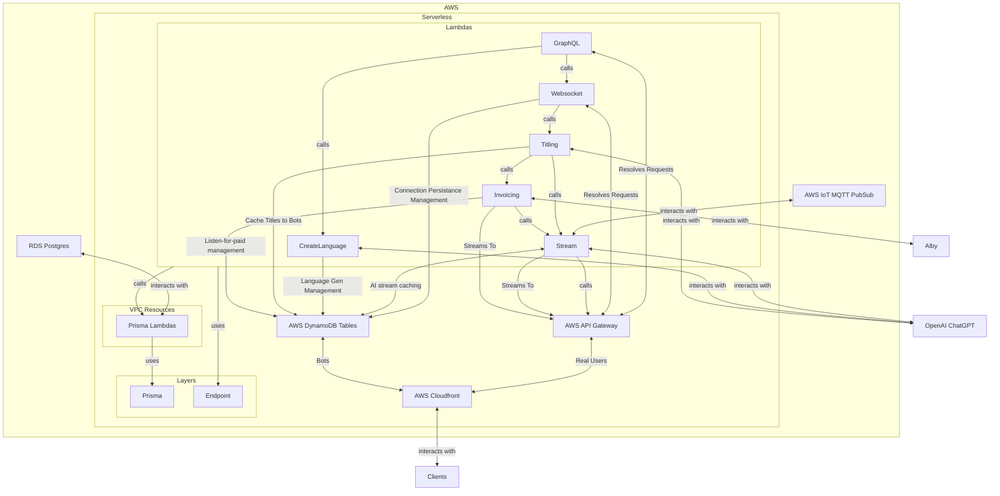
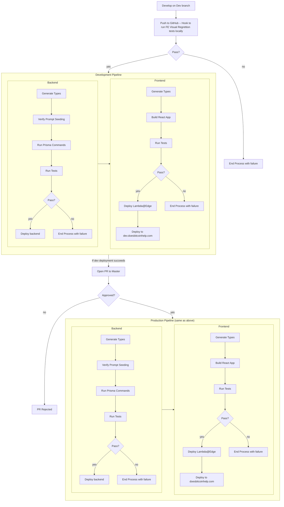

# Does Bitcoin Help?

|                 | URL                                                                | Model         |
| --------------- | ------------------------------------------------------------------ | ------------- |
| **Production**  | [https://doesbitcoinhelp.com](https://doesbitcoinhelp.com)         | GPT-4         |
| **Development** | [https://dev.doesbitcoinhelp.com](https://dev.doesbitcoinhelp.com) | GPT-3.5 Turbo |

"Does Bitcoin Help?" uses generative AI to illustrate how Bitcoin can be beneficial to, not _various_, but _ALL_ facets of humanity worldwide. The central objective is to generate and/or distribute compelling, context-specific arguments to demonstrate Bitcoin's universal applicability and utility for any chosen input.

We believe that Bitcoin, the only decentralized, transparent, permissionless, uncensorable, fixed-supply, and globally accessible digital currency, has profound implications for not just economics but justice, mercy, and overall human progress and flourishing, for every human in existence, and by extension every entity on the earth, and the earth itself. As such, we are forced to conclude that the greatest harbinger of evil ever perpetrated against humanity and reality is fiat currency. This project all but proves this to be correct.

Indeed, Bitcoin helps fix _everything_.

## Features:

### Any language

Bitcoin is for ALL people. Hence, this project incorporates AI translation capabilities, providing outputs in not just a multitude of languages, but in every language expressible in the [IETF BCP 47 language tag standard](https://en.wikipedia.org/wiki/IETF_language_tag), making it absolutely global, with finality.

### Any Accessibility Level

Accessibility is a core tenet of this project as all humans means ALL HUMANS. First, we aim to break down complex technical concepts into easily understandable arguments. From people with no prior knowledge of cryptocurrencies to experts in the field, we believe everyone should understand and appreciate the benefits of Bitcoin. Second, we endeavor to adhere to [A11y](https://www.a11yproject.com/) web standards for Accessibility. Lastly, we have designed the website with apex scalability in mind.

### Any Device

In the digital era, device inclusivity is key to democratizing information access. Regardless of the device you use - be it a high-end smartphone, a basic feature phone with internet capabilities, a desktop computer, or even devices with assistive technology for differently-abled individuals, the "Does Bitcoin Help?" project is optimized for access, comprehension, and convenience from mobile-first, and context-dependent design principles.

### Any People Group

"Does Bitcoin Help?" upholds the philosophy that Bitcoin is not restricted to any socioeconomic, ethnic, or geographical group. It is as much for a Wall Street investor as it is for a subsistence farmer in a developing country. The project seeks to demonstrate how Bitcoin can empower any individual and group, from the obvious upside of fostering economic independence to the less obvious knock-on effects of improving all varieties of culture.

### Any Ideology

Bitcoin transcends political, ethical, spiritual, religious and other not-so-provable divides. Bitcoin is blind, it does not favor any particular political belief system or ideology. As such, it benefits ALL systems of belief for all people. This project can generate arguments from _any perspective_ and show why Bitcoin is fundamentally aligned with that perspective and helps fulfill key tenants that the perspective holds.

### Any Issue

"Does Bitcoin Help?" is more than just a platform advocating for the adoption of Bitcoin. It is as a dynamic tool that generates compelling arguments to illustrate how Bitcoin can address not just a myriad of issues that affect our world today, but every single issue. These range from personal financial challenges to global energy disparities, systemic corruption, debt, climate change, and much more. There is a big difference between "a lot" and "every", the point of this project is to show that Bitcoin applies to and helps fix not a lot, but every issue.

### Any Amount of People

To ensure universal access and to cater to the global audience, this project utilizes the elasticity of AWS Lambda for backend computing, and AWS' CloudFront for frontend delivery. This allows us to handle any volume of requests without compromising on service quality, ensuring that the arguments generated are always available to everyone, anytime, and from anywhere around the globe. To manage the AWS and OpenAI costs associated with unlimited scaling and content, we limit output and add bitcoin payments via lightning and Alby to unlock, and thus pay for, unlimited content generation and delivery.

# The Argument

I'll let ChatGPT explain what this project does:

> Exhaustive enumeration, also known as complete case analysis, is a robust method of investigation that strives to uncover truth by examining every possible scenario within a given context. Its power lies in its methodical and comprehensive nature, systematically analyzing all conceivable circumstances to validate or refute a particular assertion. This approach not only preempts potential counter-arguments but also ensures a meticulous exploration of the subject. In essence, exhaustive enumeration serves as an academic sieve, sifting through each case to reach the most reliable and undiluted understanding of the issue at hand. It can be seen as a unique instrument of intellectual inquiry, often providing the most reliable pathway to discerning truth.

> Applying this methodology, this project seeks to validate the assertion, "Bitcoin fixes that." It aims to rigorously demonstrate how Bitcoin, as a groundbreaking technological and financial innovation, can ameliorate various problems across an exhaustive spectrum of circumstances. This entails a complete case analysis, considering every potential context, individual perspective, and situation to evaluate Bitcoin's potential for improvement or resolution. In essence, this study deploys exhaustive enumeration as an academic tool to reveal the potential of Bitcoin as a universal solution or enhancement in all conceivable scenarios.

You will note that the only way to employ such an argument, sans AI, is to have what amounts to "unlimited money". The playbook is easy and powerful (but expensive): this is how CocaCola convinces the world sugar is good. Likewise, I assert that the only way fiat has been able to dominate the academic and intellectual stage is because it is indeed, exactly that, _unlimited money_, which can always pay more for more bullshit. Perhaps some of the arguments herein are also bullshit; they certainly do gaslight every issue their is. But I suppose that is the point: their is a hint of truth to not some of them, but all of them, Bitcoin may not fix most things outright, but it does fix everything on the margin. Yes, **everything**. Problematically, if fiat apologists were to fork and deploy this very same project to prove fiat is good, they will soon find out "fiat good" is an impossible premise because it fundamentally disagrees with reality where bitcoin does not. But why would they do that? After all, they already have over a century of academic rigor to draw from, making it absolutely astonishing that an oppositional opinion exists at all.

...yet here we are.

# Why?

This project is a result of reading C. Jason Mailer's [book](https://www.amazon.com/Progressives-Case-Bitcoin-Equitable-Peaceful/dp/B0C1J3DC2X) "A Progressive's Case for Bitcoin" and having the thought, "It is compelling that both a libertarian and progressive case can be made for Bitcoin. Indeed, both of those ideologies are radically opposed. What ideology does bitcoin not apply to?" Naturally, I started exploring this concept and found that there are no ideologies that do not agree with and benefit from Bitcoin, even ardent Central Bankers themselves could benefit as it removes moral hazard from their job affording them new-found integrity. Even absurdists benefit, for its hilarious that novel internet nerd money works better than credit cards, treasuries, and remittance combined. Naturally, the next step was to expand the search, to all people groups, and all languages. This project is the result. (Oh, and it was also inspired a little by [The Library of Babel](https://libraryofbabel.info))

But more than all of that, I simply got tired of writing hundreds of these essay by hands for friends and family. The templates used in the prompts herein are the culmination of years of writing and finding patterns in the stories I have told over and over about how important Bitcoin is for so many of the circumstances I have come across.

Oh, and I wanted to put together a portfolio project that combined Bitcoin and AI because I am presently looking for a job in Bitcoin, get a hold of me on twitter [@gildedpleb](https://twitter.com/gildedpleb)

# Architecture

The base architecture is AWS Lambda as managed by Serverless with a React Frontend connected via Apollo server/client. The app reads browser set language, and begins generating that specific Language, defaulting to English. The user chooses and submits inputs, and if those inputs have not been generated before, OpenAI begins streaming a new essay to all subscribers listening at doesbitcoinhelp.com/{language}/{id}. Results are cached in PostgreSQL for future lookup. There were some serious difficulties and concerns in the delivery and access of AI Streaming data: streaming AI data feels like a modern day Ticker Tape Machine. Publishing that stream, ensuring its correct order, and then hooking into that stream requires a PubSub framework and stream caching. Further, to pay for cost overages, we add a custom lightning paywall that unlocks after a wait period or after payment.

The general flow is as follows:

### Frontend

### Backend

### CI/CD

[Hook to run FE Visual Regrettion tests locally]
|Start CI/CD pipeline which deploys to dev or fails|

## The Maths

For the curious, the math on the potential output is,

    Total BCP-47 Tags = Languages * Scripts * Regions + Other
    Total BCP-47 Tags = 8,101 * 150 * (249+899) + 16,202
    Total BCP-47 Tags = ~1.4 Billion

    Total Affiliations = 17 categories * ~ 20 Affiliations each
    Total Affiliations = 340

    Total Issues = 15 categories * ~ 20 Issues each
    Total Issues = 300

    Total Essays = Total BCP-47 Tags * Total Affiliations * Total Issues
    Total Essays = ~1.4 Billion * 340 * 300
    Total Essays = ~142.2 trillion ways that Bitcoin helps!

    or 17,775 ways to help per person on earth.

    or given an average lifespan of 80 years, we could say, "Every 1 day and 14.6 hours, Bitcoin provides a new and unique solution to a problem for each person on Earth."

    This is why they call it "falling down the rabit whole"; the revelations cascade on a daily scale!
